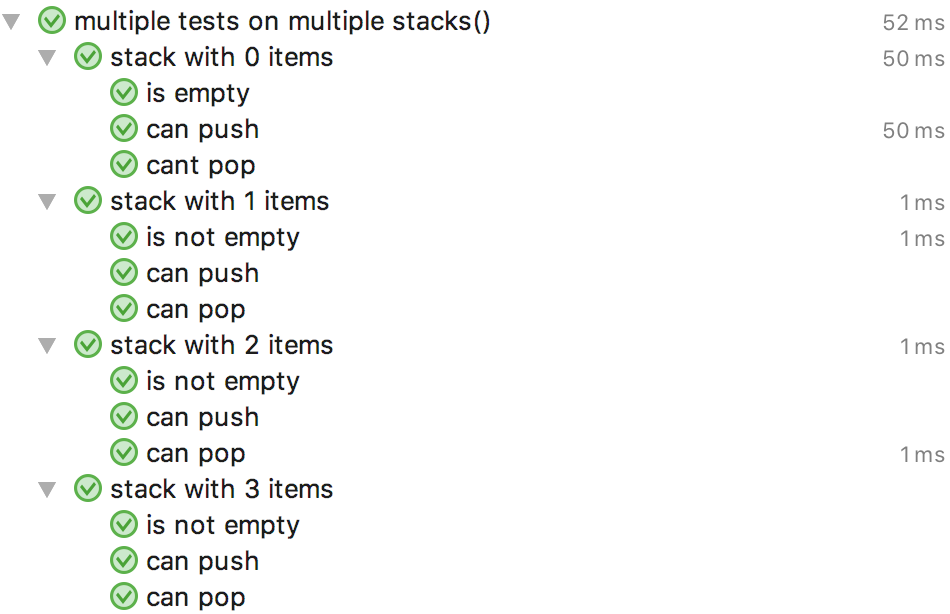

# Minutest

[  ](https://bintray.com/dmcg/oneeyedmen-mvn/minutest/_latestVersion)

Minutest brings Spec-style testing to JUnit 5 and Kotlin.

## Installation

I don't think that Minutest is ready for Android or KotlinJS or KotlinNative projects yet. Sorry. If you prove me wrong please let me know.

You can find the latest binaries and source in a Maven-compatible format on [JCenter](https://bintray.com/dmcg/oneeyedmen-mvn/minutest). So you need to reference JCenter as a repository.

```groovy
repositories {
    jcenter()
}
```

You will need to include Minutest and JUnit 5 on your test compilation classpath, and the JUnit engine on your test runtime classpath. 

```groovy
testCompile "org.junit.jupiter:junit-jupiter-api:+"
testCompile "com.oneeyedmen:minutest:+"

testRuntime "org.junit.jupiter:junit-jupiter-engine:+"
testRuntime "org.junit.platform:junit-platform-launcher:+"
```

Finally you need to let test tasks know to use JUnit 5

```groovy
tasks {
    test {
        useJUnitPlatform()
        testLogging {
            events "skipped", "failed"
        }
    }
}
```

My apologies to the Mavenites. If you are one then please try to work out what to do based on the [JUnit 5 docs](https://junit.org/junit5/docs/current/user-guide/#installation) and then submit a PR for this readme!

## Usage

To just test simple functions, define your tests in a subclass of JupiterTests. The JUnit 5 [first test case](https://junit.org/junit5/docs/current/user-guide/#writing-tests) looks like this.

```insert-kotlin core/src/test/kotlin/com/oneeyedmen/minutest/examples/FirstMinutests.kt
```

Most tests require access to some state. The collection of state required by the tests is called the test fixture. If you are testing a class, at simplest the fixture might be an instance of the class.

```insert-kotlin core/src/test/kotlin/com/oneeyedmen/minutest/examples/SimpleStackExampleTests.kt
```

More complicated tests will have more than one piece of state. 

```insert-kotlin core/src/test/kotlin/com/oneeyedmen/minutest/examples/FixtureExampleTests.kt
```

Minutests can be defined in a Spec style, with nested contexts and tests. The JUnit 5 [Nested Tests example](https://junit.org/junit5/docs/current/user-guide/#writing-tests-nested) translates like this 

```insert-kotlin core/src/test/kotlin/com/oneeyedmen/minutest/examples/StackExampleTests.kt
```

This runs the following tests


## Parameterised Tests

The key to Minutest is that by separating the fixture from the test code, both are made available to manipulate as data. 

For example, parameterised tests require [special handling](https://junit.org/junit5/docs/current/user-guide/#writing-tests-parameterized-tests) in JUnit, but not in Minutest.

```insert-kotlin core/src/test/kotlin/com/oneeyedmen/minutest/examples/ParameterisedTests.kt
```


## Reusing Tests

More complicated scenarios can be approached by writing your own function that returns a test or a context.
 
If you want to reuse the same tests for different concrete implementations, define a context with a function and call it for subclasses. Some people call this a contract.

```insert-kotlin core/src/test/kotlin/com/oneeyedmen/minutest/examples/ContractsExampleTests.kt
```

## Generate Tests

Go crazy and unleash the `Power of Kotlin` to generate your tests on the fly.

```insert-kotlin core/src/test/kotlin/com/oneeyedmen/minutest/examples/GeneratingExampleTests.kt
```

The last of these generates the following tests



## Immutable Fixtures

Are you a functional programmer slumming it with Kotlin? Minutest allows immutable fixtures.

```insert-kotlin core/src/test/kotlin/com/oneeyedmen/Minutest/examples/ImmutableExampleTests.kt
```

## JUnit Rules

Power JUnit 4 user? Minutest supports JUnit 4 TestRules. As far as I can tell, it does it better than JUnit 5!

```insert-kotlin core/src/test/kotlin/com/oneeyedmen/Minutest/examples/JUnitRulesExampleTests.kt
```

## Support

Minutest is still feeling its way towards a humane API. Until we reach version 1 this is subject to change - we'll try not to break things but it's better to move fast. Please do let us know what is working and what isn't, either physically or conceptually.

The best bet for feedback and help is the [#minutest channel on the Kotlin Slack](https://kotlinlang.slack.com/messages/CCYE00YM6). See you there.