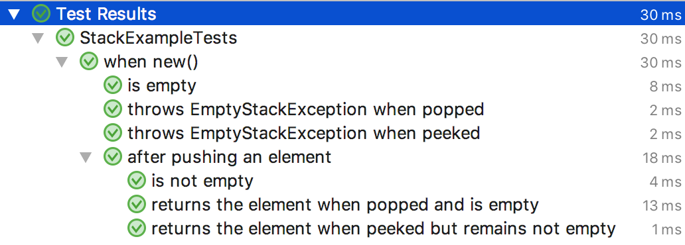
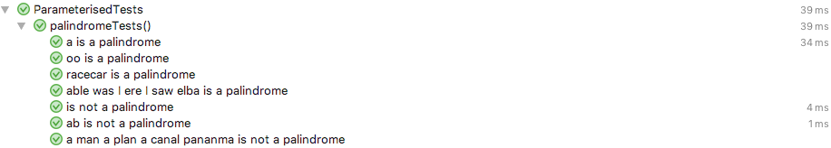

# Minutest

[  ](https://bintray.com/dmcg/oneeyedmen-mvn/minutest/_latestVersion)

Minutest brings the power of Kotlin to JUnit 5, giving

* Spec-style nested contexts and tests
* Easy reuse of test code
* On-the fly generation of tests
* A level of expressiveness that has changed the way I write tests.

## Installation

[Instructions](installation.md)

## Usage

To just test simple functions, define your tests in a subclass of JUnit5Minutests. The JUnit 5 [first test case](https://junit.org/junit5/docs/current/user-guide/#writing-tests) looks like this.

```kotlin
// Implement JUnit5Minutests to run Minutests with JUnit 5
class FirstMinutests : JUnit5Minutests {

    // tests are grouped in a context
    override val tests = rootContext<Unit> {

        // define a test by calling test
        test("my first test") {
            // Minutest doesn't have any built-in assertions.
            // Here I'm using JUnit assertEquals
            assertEquals(2, 1 + 1)
        }

        // here is another one
        test("my second test") {
            assertNotEquals(42, 6 * 9)
        }
    }
}
```

Most tests require access to some state. The collection of state required by the tests is called the test fixture. If you are testing a class, at simplest the fixture might be an instance of the class.

```kotlin
class SimpleStackExampleTests : JUnit5Minutests {

    // The fixture type is the generic type of the test, here Stack<String>
    override val tests = rootContext<Stack<String>> {

        // The fixture block tells Minutest how to create an instance of the fixture.
        // Minutest will call it once for every test.
        fixture {
            Stack()
        }

        test("add an item") {
            // In a test, 'this' is the fixture created above
            assertTrue(this.isEmpty())

            this.add("item")
            assertFalse(this.isEmpty())
        }

        // another test will use a new fixture instance
        test("fixture is fresh") {
            // you can also access the fixture as 'fixture' if it reads nicer
            assertTrue(fixture.isEmpty())

            // or use the implicit 'this'
            assertFalse(isNotEmpty())
        }
    }
}
```

Minutests can be defined in a Spec style, with nested contexts and tests. The JUnit 5 [Nested Tests example](https://junit.org/junit5/docs/current/user-guide/#writing-tests-nested) translates like this 

```kotlin
class StackExampleTests : JUnit5Minutests {

    override val tests = rootContext<Stack<String>> {

        // The tests in the root context run with this empty stack
        fixture {
            Stack()
        }

        test("is empty") {
            assertTrue(fixture.isEmpty())
        }

        test("throws EmptyStackException when popped") {
            assertThrows<EmptyStackException> { pop() }
        }

        test("throws EmptyStackException when peeked") {
            assertThrows<EmptyStackException> { peek() }
        }

        // nested a context
        context("after pushing an element") {

            // This context modifies the fixture from its parent -
            // the tests run with the single item stack.
            modifyFixture {
                parentFixture.push("one")
            }

            test("is not empty") {
                assertFalse(fixture.isEmpty())
            }

            test("returns the element when popped and is empty") {
                assertEquals("one", pop())
                assertTrue(fixture.isEmpty())
            }

            test("returns the element when peeked but remains not empty") {
                assertEquals("one", peek())
                assertFalse(fixture.isEmpty())
            }
        }
    }
}
```

This runs the following tests



Tests for cooperating components will typically have one piece of state. In this case make the fixture hold all the state. 

```kotlin
class ControlPanel(
    val keySwitch: () -> Boolean,
    val beep: () -> Unit,
    val launchMissile: () -> Unit
) {
    fun pressButton() {
        if (keySwitch())
            launchMissile()
        else
            beep()
    }
    val warningLight get() = keySwitch()
}

class CompoundFixtureExampleTests : JUnit5Minutests {

    class Fixture() {
        // Rather than introduce a mocking framework, we can work with
        // functions and mutable state.
        var keySwitchOn = false
        var beeped = false
        var missileLaunched = false

        val controlPanel = ControlPanel(
            keySwitch = { keySwitchOn },
            beep = { beeped = true },
            launchMissile = { missileLaunched = true }
        )
    }

    override val tests = rootContext<Fixture> {
        fixture { Fixture() }

        context("key not turned") {
            test("light off") {
                assertFalse(controlPanel.warningLight)
            }
            test("cannot launch") {
                controlPanel.pressButton()
                assertTrue(beeped)
                assertFalse(missileLaunched)
            }
        }

        context("key turned") {
            modifyFixture {
                keySwitchOn = true
            }
            test("light on") {
                assertTrue(controlPanel.warningLight)
            }
            test("will launch") {
                controlPanel.pressButton()
                assertFalse(beeped)
                assertTrue(missileLaunched)
            }
        }
    }
}
```

Understanding fixtures is key to Minutest - [read more](fixtures.md)

## Parameterised Tests

The key to Minutest is that by separating the fixture from the test code, both are made available to manipulate as data. 

For example, parameterised tests require [special handling](https://junit.org/junit5/docs/current/user-guide/#writing-tests-parameterized-tests) in JUnit, but not in Minutest.

```kotlin
class ParameterisedTests : JUnit5Minutests {

    override val tests = rootContext<Unit> {

        // Once we are in a context, running the same tests for multiple parameters is
        // as easy as calling `test()` for each one.
        listOf("a", "oo", "racecar", "able was I ere I saw elba").forEach { candidate ->
            test("$candidate is a palindrome") {
                assertTrue(candidate.isPalindrome())
            }
        }

        listOf("", "ab", "a man a plan a canal pananma").forEach { candidate ->
            test("$candidate is not a palindrome") {
                assertFalse(candidate.isPalindrome())
            }
        }
    }
}

fun String.isPalindrome(): Boolean =
    if (length == 0) false
    else (0 until length / 2).find { index -> this[index] != this[length - index - 1] } == null
```



## Reusing Tests

More complicated scenarios can be approached by writing your own function that returns a test or a context.
 
If you want to reuse the same tests for different concrete implementations, define a context with a function and call it for subclasses. Some people call this a contract.

```kotlin
// To run the same tests against different implementations, first define a TestContext extension function
// that defines the tests you want run.
fun ContextBuilder<MutableCollection<String>>.behavesAsMutableCollection() {

    context("behaves as MutableCollection") {

        test("is empty when created") {
            assertTrue(isEmpty())
        }

        test("can add") {
            add("item")
            assertEquals("item", first())
        }
    }
}

// Now tests can supply the fixture and invoke the function to create the tests to verify the contract.
class ArrayListTests : JUnit5Minutests {

    override val tests = rootContext<MutableCollection<String>> {
        fixture {
            ArrayList()
        }

        behavesAsMutableCollection()
    }
}

// We can reuse the contract for different collections.
class LinkedListTests : JUnit5Minutests {

    override val tests = rootContext<MutableCollection<String>> {
        fixture {
            LinkedList()
        }

        behavesAsMutableCollection()
    }
}
```

## Other Features

* [Generating tests](generating-tests.md)
* [Running only certain tests](focus-and-skip.md)
* [JUnit rules](junit-rules.md)

## Support

Minutest is still feeling its way towards a humane API. Until we reach version 1 this is subject to change - we're trying to balance not breaking things with getting better quickly. Please do let us know what is working and what isn't, either physically or conceptually.

The best bet for feedback and help is the [#minutest channel on the Kotlin Slack](https://kotlinlang.slack.com/messages/CCYE00YM6). See you there.